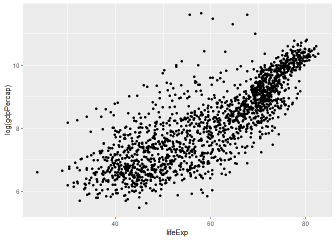

cm006 Exercises: Exploring Geometric Objects
================

In this worksheet, we’ll be exploring various plot types (i.e.,
geometric objects), only using the `x` and `y` aesthetics (and `group`).

1.  To get started, load the `tidyverse` and `gapminder` R
    packages.

<!-- end list -->

``` r
library(tidyverse)
```

    ## -- Attaching packages ----------------------------------------------------------------------------------- tidyverse 1.2.1 --

    ## v ggplot2 3.0.0     v purrr   0.2.5
    ## v tibble  1.4.2     v dplyr   0.7.6
    ## v tidyr   0.8.1     v stringr 1.3.1
    ## v readr   1.1.1     v forcats 0.3.0

    ## -- Conflicts -------------------------------------------------------------------------------------- tidyverse_conflicts() --
    ## x dplyr::filter() masks stats::filter()
    ## x dplyr::lag()    masks stats::lag()

``` r
library(gapminder)
```

## Scatterplot

Let’s look at a *scatterplot* of `gdpPercap` vs. `lifeExp`.

1.  Fill out the grammar components below. Again, bold *must* be
    specified to make a `ggplot2` plot.
      - We’ll ignore “coordinate system” and “facetting” after this.

| Grammar Component     | Specification |
| --------------------- | ------------- |
| **data**              | `gapminder`   |
| **aesthetic mapping** | `x` and `y`   |
| **geometric object**  | point         |
| scale                 | linear        |
| statistical transform | none          |
| coordinate system     | rectangular   |
| facetting             | none          |

2.  Populate the data and aesthetic mapping in `ggplot`. What is
    returned? What’s missing?

<!-- end list -->

``` r
p <- ggplot(gapminder, aes(x=lifeExp, y=gdpPercap))
p
```

<!-- -->

3.  Add the missing component as a *layer*.

<!-- end list -->

``` r
p + geom_point()
```

<!-- -->

Notice the “metaprogramming” again\!

4.  You *must* remember to put the aesthetic mappings in the `aes`
    function\! What happens if you forget?

<!-- end list -->

``` r
# ggplot(gapminder, x=lifeExp, y=gdpPercap) + 
#  geom_point()
```

5.  Put the x-axis on a log scale, first by transforming the x variable.
      - Note: `ggplot2` does some data wrangling and computations
        itself\! We don’t always have to modify the data frame.

<!-- end list -->

``` r
ggplot(gapminder, aes(x=lifeExp, y=log(gdpPercap))) + 
  geom_point()
```

<!-- -->

6.  Try again, this time by changing the *scale* (this way is better).

<!-- end list -->

``` r
ggplot(gapminder, aes(lifeExp, gdpPercap)) +
  geom_point() +
  scale_y_log10()
```

<!-- -->

7.  The aesthetic mappings can be specified on the geom layer if you
    want, instead of the main `ggplot` call. Give it a try:

<!-- end list -->

``` r
ggplot(gapminder) + 
  geom_point(aes(x=lifeExp, y=gdpPercap))
```

<!-- -->

8.  Optional: git stage and commit

**Uses of a scatterplot**:

  - Visualize 2-dimensional distributions; dependence.
  - 2 numeric variables

## Histograms, and Kernel Density Plots

Let’s build a histogram of life expectancy.

1.  Fill out the grammar components below. Again, bold *must* be
    specified to make a `ggplot2` plot.

| Grammar Component     | Specification |
| --------------------- | ------------- |
| **data**              | `gapminder`   |
| **aesthetic mapping** |               |
| **geometric object**  |               |
| scale                 |               |
| statistical transform |               |

2.  Build the histogram of life expectancy.

3.  Change the number of bins to 50.

4.  Instead of a histogram, let’s create a kernel density plot.

5.  Optional: git stage and commit

**Uses of a histogram**: Explore the distribution of a single numeric
variable.

## Box plots, and violin plots

Let’s make *box plots* of population for each continent. Note: y-axis is
much better on a log scale\!

1.  Fill out the grammar components below. Again, bold *must* be
    specified to make a `ggplot2` plot.

| Grammar Component     | Specification |
| --------------------- | ------------- |
| **data**              | `gapminder`   |
| **aesthetic mapping** |               |
| **geometric object**  |               |
| scale                 |               |
| statistical transform |               |

2.  Initiate the `ggplot` call, with the log y scale, and store it in
    the variable `a`. Print out `a`.

3.  Add the boxplot geom to `a`.

4.  A violin plot is a kernel density on its side, made symmetric. Add
    that geom to `a`.
    
      - What’s better here, boxplots or violin plots? Why?

5.  Optional: git stage and commit

**Use of boxplot**: Visualize 1-dimensional distributions (of a single
numeric variable).

## Jitter plots

Let’s work up to the concept of a *jitter plot*. As above, let’s explore
the population for each continent, but using points (again, with the
y-axis on a log scale).

Let’s hold off on identifying the grammar.

1.  Initiate the `ggplot` call to make a scatterplot of `continent` vs
    `pop`; initiate the log y scale. Store the call in the variable `b`.

2.  Add the point geom to `b`. Why is this an ineffective plot?

3.  A solution is to jitter the points. Add the jitter geom. Re-run the
    command a few times – does the plot change? Why?

4.  How does the grammar differ from a box plot or violin plot?
    
      - ANSWER:

5.  We can add multiple geom *layers* to our plot. Put a jitterplot
    overtop of the violin plot, starting with our base `b`. Try
    vice-versa.

6.  Optional: git stage and commit

**Uses of jitterplot**: Visualize 1-dimensional distributions, AND get a
sense of the sample size.

## Time/Line Plots

Let’s make some time/line plot, starting with Canada’s life expectancy
over time.

1.  Fill out the grammar components below. Again, bold *must* be
    specified to make a `ggplot2` plot.

| Grammar Component     | Specification |
| --------------------- | ------------- |
| **data**              | `gapminder`   |
| **aesthetic mapping** |               |
| **geometric object**  |               |
| scale                 |               |
| statistical transform |               |

2.  In one readable call, write code that:
    
    1.  Filters the data to Canada only
    2.  Pipes the filtered data into `ggplot`
    3.  Makes the time plot of `lifeExp` over time
    4.  Also displays the points

3.  Attempt to overlay line plots for all countries. That is, repeat the
    above code, but don’t filter. What’s wrong here?

4.  Use the `group` aesthetic to fix the problem.

5.  Optional: git stage and commit

**Uses of time/line plots**: Visualize trends of a numeric variable over
time.

## Path plots

Let’s see how Rwanda’s life expectancy and GDP per capita have evolved
over time, using a path plot.

1.  Make a scatterplot. Store it in the variable `c`.

2.  We want to connect the dots from earliest point to latest. What
    happens if we add the “line” geom to `c`?

3.  Add the appropriate geom to `c`. In that geom, specify a property of
    the geom: `arrow=arrow()`.

4.  Optional: git stage and commit

**Uses of path plots**: The four “corners” of the plot usually indicate
different qualities. This plot allows you to see how Rwanda (or some
entity) evolves over these qualities.

## Bar plots

How many countries are in each continent? Use the year 2007.

1.  Fill out the grammar components below. Again, bold *must* be
    specified to make a `ggplot2` plot.

| Grammar Component     | Specification |
| --------------------- | ------------- |
| **data**              | `gapminder`   |
| **aesthetic mapping** |               |
| **geometric object**  |               |
| scale                 |               |
| statistical transform |               |

2.  After filtering the gapminder data to 2007, make a bar chart of the
    number of countries in each continent. Store everything except the
    geom in the variable `d`.

3.  Notice the y-axis. Oddly, `ggplot2` doesn’t make it obvious how to
    change to proportion. Try adding a `y` aesthetic:
    `y=..count../sum(..count..)`.

4.  Optional: git stage, commit, and push\!

**Uses of bar plots**: Get a sense of relative quantities of categories,
or see the probability mass function of a categorical random variable.
