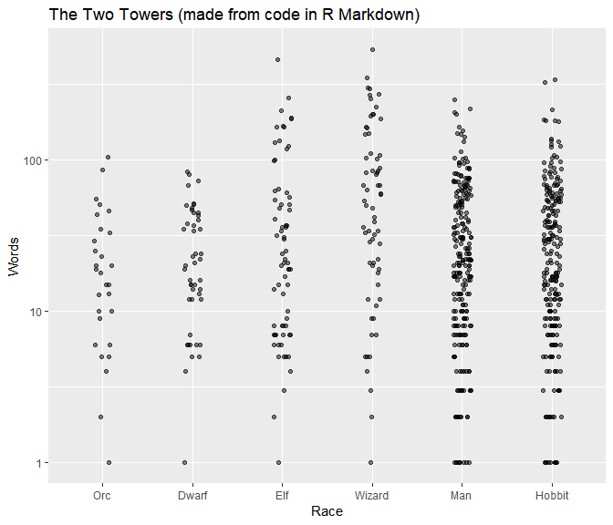
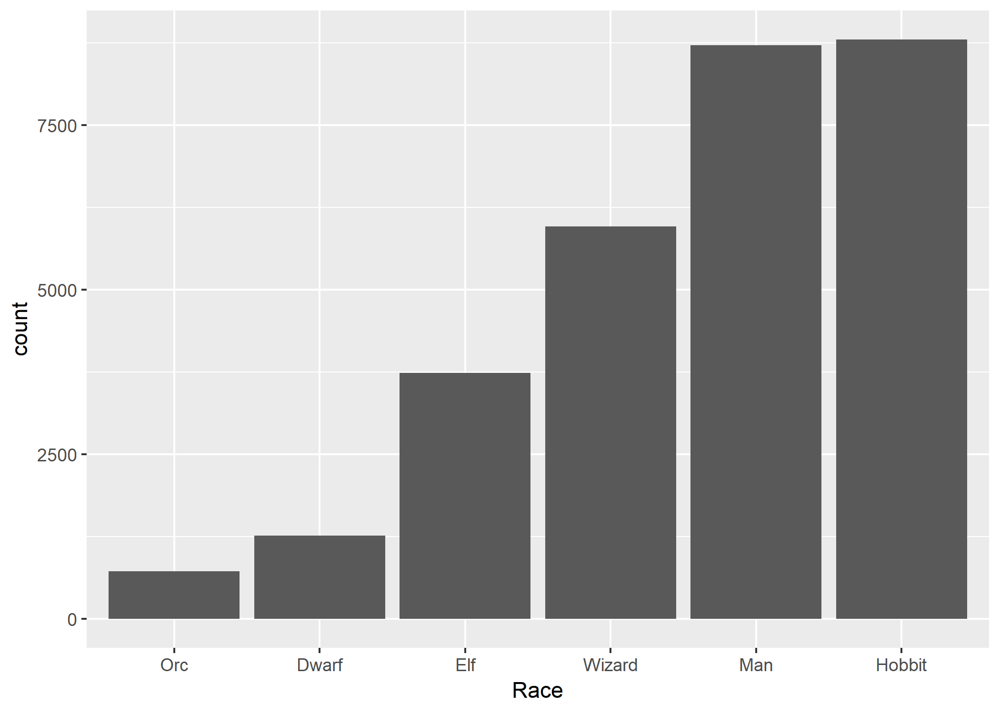

---
output:
  html_document:
    keep_md: yes
---
LOTR R Markdown file
========================================================

This is an R Markdown document. In this example, its purpose is to allow us to demonstrate how to use `rmarkdown::render()` without the help of RStudio's buttons. We will, in fact, call `rmarkdown::render()` from within a `Makefile`.

Here is a plot we are making "on the fly" via code in an R chunk.
<!-- -->

Here is a pre-made plot we are merely embedding in the compiled document.

